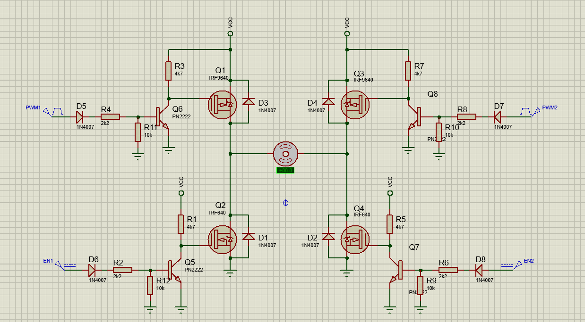
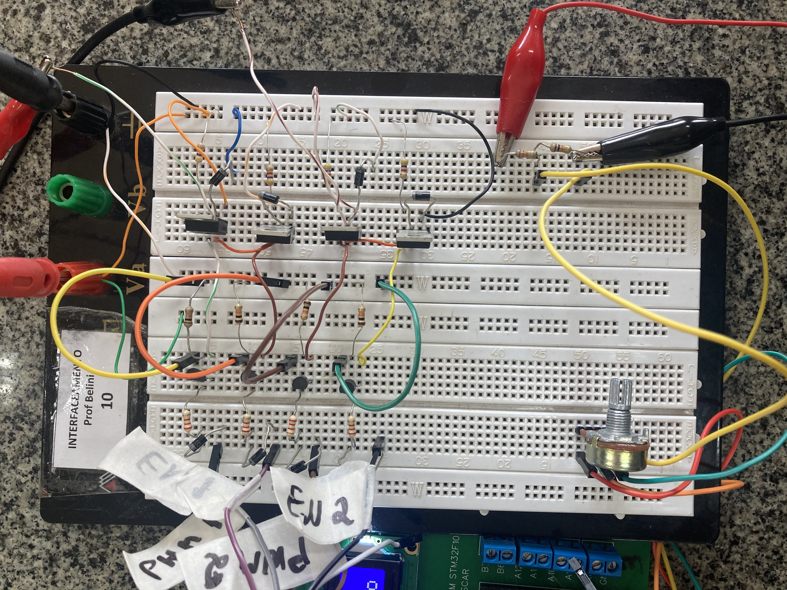
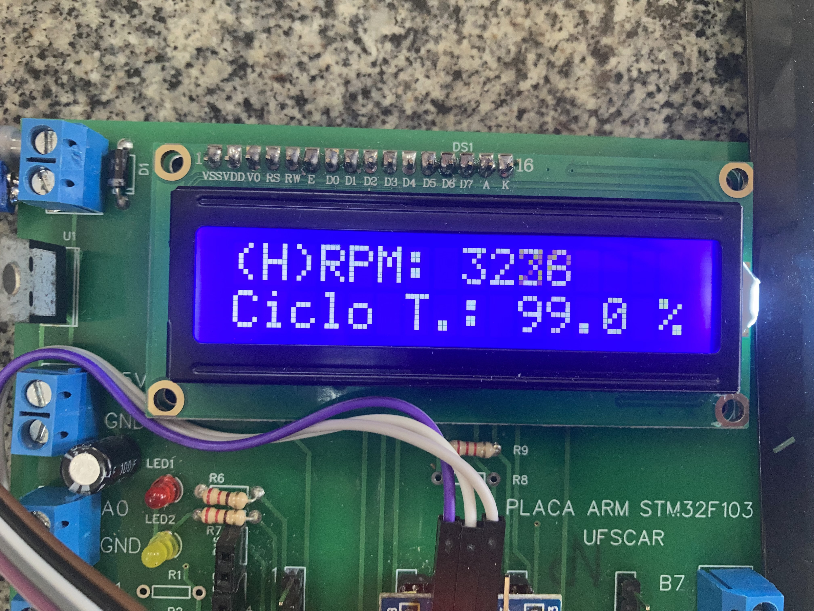
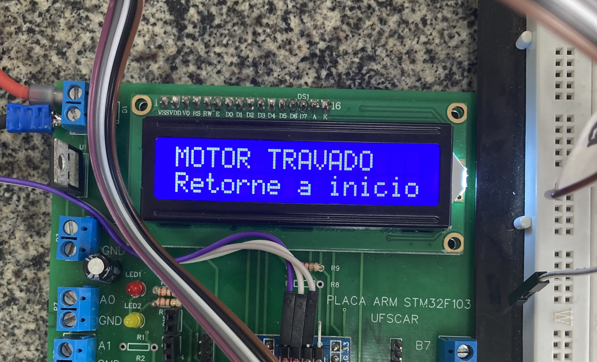

# Protótipo de um instrumento para dentista
Protótipo de um instrumento para dentistas que consiste em um Motor CC controlado por um micro STM32F103 através de uma ponte H com acionamento via pedal.
No projeto em bancada o pedal é simulado através do uso de um potenciômetro.

## Requisitos
- Operação:
    - Rotacionar suavemente o potênciometro da posição de repouso (resistência mínima) deve atualizar a velocidade do motor proporcionalmente a posição do potenciômetro, permitindo ao operador selecionar uma velocidade desejada.
    - A velocidade selecionada deve ser mantida ao retornar o potênciometro.
    - A velocidade só deve ser alterada caso o potênciometro volte a posição de repouso e seja novamente incrementado, selecionando uma nova velocidade.
    - Acionar o pedal (potênciometro) até o fim do curso duas vezes consecutivas deve inverter o sentido de giro.
    - A velocidade e sentido de giro do motor devem ser exibidas no display, assim como alertas de proteção.
- Segurança:
    - Situações de carga acima do limite (motor travado) devem ser identificadas pelo microcontrolador que deve desligar o motor.
    - Quando o pedal for pressionado rapidamente e por curta extensão o motor deve ser desligado.
    - O motor pode ser re-acionado retornando o potênciometro ao repouso.

 </br></br>
 
## Planta do motor CC
A Figura 1 exibe a planta do motor CC utilizado. Não foi utilizado a planta como um todo, somente o sistema de acionamento que recebe um sinal PWM do microcontrolador, e o encoder.
Ao lado vemos o controlador seguido pela protoboard com a ponte H, potênciometro e divisor de tensão para leitura do encoder.

<p align="center">
Figura 1 - Planta do motor CC.
</p>


</br></br>

## Acionamento - Ponte H
Para controlar o motor CC, como é necessário inverter o sentido de giro, fez-se uso do circuito ponte H, exibido pela Figura 2.

<p align="center">
Figura 2 - Circuito da ponte H.
</p>



Devido a limitações do microcontrolador, a tensão fornecida não é suficiente para acionar os MOSFETs de potência diretamente, dessa forma fez-se uso de BJTs para acionar os MOSFETS. Uma grande vantagem dessa configuração é a baixa corrente drenada do microcontrolador, devido ao alto ganho de corrente fornecido pelos BJTs.

Os resistores foram dimensionados de forma a garantir um rápido transitório (levando em consideração que os resistores e a porta dos MOSFETs formam um circuito RC) para que os MOSFETs sejam operados como chave e fiquem o menor tempo possível na zona ôhmica, o que também garante que os mesmos não esquentam de forma exagera durante a operação.

A ponte H implementada em bancada é exibida pela Figura 3.

<p align="center">
Figura 3 - Ponte H implementada em bancada.
</p>



</br></br>

## Display
Atendendo os requisitos do a velocidade, o sentido de giro (H) para sentido Horário e (A) para Anti-horário são exibidos como mostra Figura 4. Como um extra e para propósitos de debugging, o ciclo de trabalho do PWM que o microcontrolador fornece ao sistema de acionamento também é exibido.

<p align="center">
Figura 5 - Display em operação nominal.
</p>



Agora, caso ocorra algum problema na operação o motor é desligado e é emitido um alerta do problema no display, como exibido pela Figura 5.

<p align="center">
Figura 5 - Display quando há um problema identificado.
</p>



</br></br>

## Programa embarcado
Toda a lógica necessária para implementar cada um dos requisitos pode ser vista no código fonte presente na <a href="CubeIDE Workspace/Core/Src/main.c" class="image fit">main</a>.
Abaixo é exibido somente o loop de controle presente na main sem comentários para melhor visualização.

```
while (1){
  current_time = HAL_GetTick();
  HAL_ADC_Start(&hadc1);
  HAL_ADC_PollForConversion(&hadc1, 20);	
  ADC_atual = HAL_ADC_GetValue(&hadc1);	

  RPM = ticks*TIM4_FREQ*60/(PPR*0.6);

  if(RPM < RPM_LOW_THR && !motor_low_speed_flag){
	  motor_low_speed_flag = 1;					
	  last_time_RPM = current_time;				
  }

  if(current_time - last_time_RPM > RPM_TIME_DELAY && motor_low_speed_flag){
	  if(RPM < RPM_LOW_THR){
		  safety_flag = 1;
		  motor_lock_flag = 1;						
	  }												
	  else{
		  motor_low_speed_flag = 0;				
	  }
  }

  if(current_time - last_time_ADC > ADC_TIME_DELAY){
	  if((int) (abs(ADC_atual - ADC_anterior)) > MAX_ADC_VARIATION){
		  safety_flag = 1;
		  fast_movment_flag = 1;
	  }
	  ADC_anterior = ADC_atual;
	  last_time_ADC = current_time;
  }

  if(safety_flag){
	  htim1.Instance->CCR2=0;
	  htim1.Instance->CCR1=0;
	  HAL_Delay(20);
	  HAL_GPIO_WritePin(en1_GPIO_Port, en1_Pin, GPIO_PIN_SET);
	  HAL_GPIO_WritePin(en2_GPIO_Port, en2_Pin, GPIO_PIN_SET);
	  duty_cycle = 0.;
  }

  if(ADC_atual < ADC_MIN_THR){						
	  en_increment = 1;									
	  safety_flag = 0;										
	  motor_lock_flag = 0;
	  fast_movment_flag = 0;
	  motor_low_speed_flag = 0;
  }

  if(ADC_atual < ADC_MAX_THR - NOISE && !safety_flag){
	  en_count = 1;
  }

  if(ADC_atual > ADC_MAX_THR && en_count && !safety_flag){
	  count = count + 1;									
	  en_count = 0;											
  }


  if((ADC_atual > maior_valor || (en_increment && ADC_atual > ADC_MIN_THR + NOISE))
     && !safety_flag){
	  maior_valor = ADC_atual;
	  en_increment = 0;

	  conversion = (int) (maior_valor/40.96);
	  duty_cycle = conversion;
	  if(sentido_giro == HORARIO){
		  htim1.Instance->CCR1=conversion;
		  htim1.Instance->CCR2=0;
	  }
	  if(sentido_giro == ANTIHORARIO){
		  htim1.Instance->CCR1=0;
		  htim1.Instance->CCR2=conversion;
	  }
  }

  if(count>=2){                // Inverte sentido de giro
	  htim1.Instance->CCR1=0;
	  htim1.Instance->CCR2=0;
	  HAL_Delay(300);
	  HAL_GPIO_WritePin(en1_GPIO_Port, en1_Pin, GPIO_PIN_SET);
	  HAL_GPIO_WritePin(en2_GPIO_Port, en2_Pin, GPIO_PIN_SET);
	  HAL_Delay(300);
	  count = 0;
	  sentido_giro=sentido_giro * -1;
  }

  if(sentido_giro == HORARIO && !safety_flag){
	  HAL_GPIO_WritePin(en1_GPIO_Port, en1_Pin, GPIO_PIN_SET);
	  HAL_GPIO_WritePin(en2_GPIO_Port, en2_Pin, GPIO_PIN_RESET);
  }

  if(sentido_giro == ANTIHORARIO && !safety_flag){
	  HAL_GPIO_WritePin(en1_GPIO_Port, en1_Pin, GPIO_PIN_RESET);
	  HAL_GPIO_WritePin(en2_GPIO_Port, en2_Pin, GPIO_PIN_SET);
  }

  if(current_time - last_time_LCD > LCD_TIME_DELAY){
	  lcd_clear();
	  if(motor_lock_flag){
		  lcd_gotoxy(0,0);
		  lcd_printf("MOTOR TRAVADO");
		  lcd_gotoxy(0,1);
		  lcd_printf("Retorne a inicio");
	  }
	  else if(fast_movment_flag){
		  lcd_gotoxy(0,0);
		  lcd_printf("MOVIMENTO RAPIDO");
		  lcd_gotoxy(0,1);
		  lcd_printf("Retorne a inicio");
	  }
	  else{
		  lcd_gotoxy(0,0);
		  lcd_printf("(%c)RPM: %0.0f ",(sentido_giro == 1) ? 'H':'A' ,RPM);
		  lcd_gotoxy(0,1);
		  lcd_printf("Ciclo T.: %0.1f %%", duty_cycle);
	  }
	  last_time_LCD = HAL_GetTick();
  }
  }
}
```

</br></br>

## Vídeo demonstração
Um vídeo que exibe o funcionamento do instrumento, atendendo todos os requisitos, pode ser visto <a href="https://youtu.be/rYY9jYwxjhg" class="image fit">aqui</a>.


